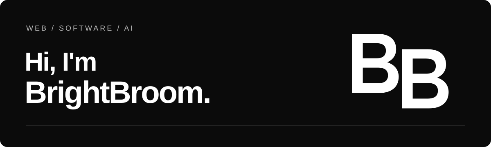
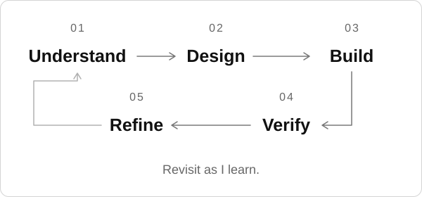

  

# A little about me

I build web apps and write about what goes into them.

My work brings together frontend development, AI, and the less visible parts of software: how people make decisions, keep track of things, and pass work on.

## How I build

There tends to be a fair bit of going back and forth here.

Before building a screen, I want to know who's using it and what they're trying to finish. That helps me decide what belongs on it, what can wait, and what needs a better explanation.

The rules behind the screen matter just as much. If an amount changes after someone checks it, does their approval still count? Working through questions like that tells me more than a list of features does.

I also try to leave the reasoning in the notes. The code can show what happens; it doesn't always explain why we chose it, what we've checked, or what's still undecided.

## Currently exploring

I'm interested in making requirements easier to test, and in how code knowledge graphs can help AI review a codebase. I'm curious about what they miss, too. A shorter prompt is useful, but I still want to know whether the review holds up.

## Writing

I write in Japanese on [Zenn](https://zenn.dev/koenigwolf) and [Qiita](https://qiita.com/brightbroom), often about the questions above.

Two articles to start with (titles translated here):

- [What to decide before building an approval button](https://zenn.dev/koenigwolf/articles/requirements-definition-guide)
- [Can code knowledge graphs improve AI code review?](https://zenn.dev/koenigwolf/articles/code-knowledge-graph-ai-review)

## Tools I use

TypeScript, React, Next.js, Tailwind CSS, and PostgreSQL. GitHub and Vercel for development and deployment, with Google OAuth and MCP where they're needed.

---

  Reading small shifts in cities, code, and AI.

